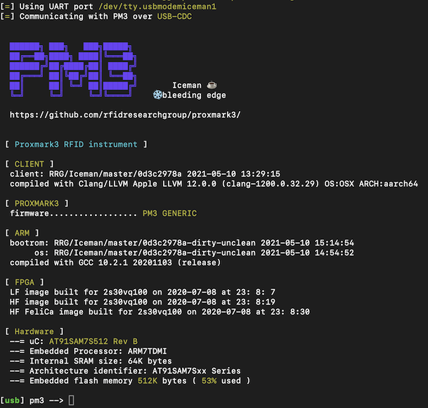
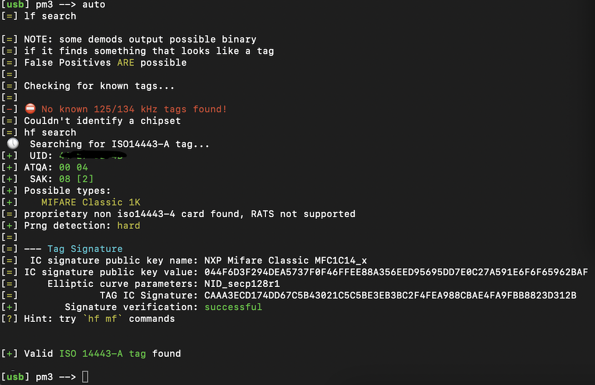
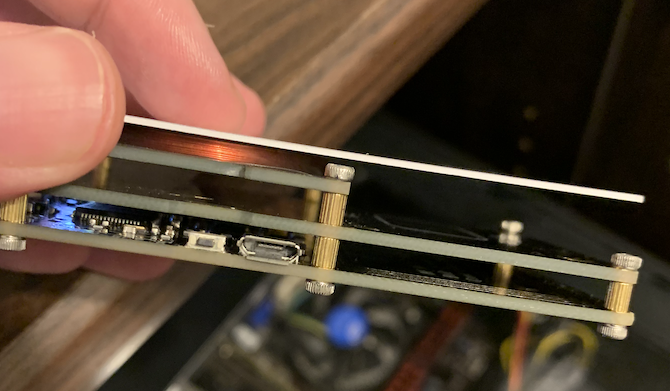

Recently I've gotten back into shooting [sporting clays](https://i.ytimg.com/vi/9hcAo2ss6fM/maxresdefault.jpg), to the point where I'd like to start competing once I'm confident enough. Wikipedia describes it as "golf with a shotgun". A course across the state uses RFID cards to record and track shooter data, and since I hadn't done any RFID hacking before, I thought I'd combine my two favorite hobbys and learn something new.

## "Smart Card" Types

There are a ton of different smart card types and standards. Regardless of what they are, they can be broken down into two categories:

- **ID cards**
  Cards which should be "immutable" and simply have a hard coded value written to the chip. When scanned, they simply respond with whatever unique ID is on the card, the reader passes the information to a system, and the system decides whether or not to allow an event to happen (ie: unlock a gym's door)

- **IC cards (integrated circuit)**
  These cards carry data on them that can be read and written to. Bus passes, arcade balances, passports -- things that we might like to change. My sporting clay course uses IC cards, and that's what this blog post is about.

## Basic Identification

A high powered flashlight is all that's needed to identify between an ID and an IC card.


ID cards will usually have a round coil inside


IC cards have a rectangle coil and a noticeable chip inside

## PROXMARK3

The Proxmark3 is a device that supports sniffing, reading, and writing to various smart cards. Historically rather expensive, recently Chinese knockoffs have made their way to the market and are being sold on Amazon for about 60$ ([link](https://www.amazon.com/Reader-KKmoon-Proxmark3-Copier-Changeable/dp/B07WPJ89PF/ref=sr_1_4?dchild=1&keywords=proxmark3&qid=1620768811&sr=8-4)). In the event you're reading this from the future and the product is no longer for sale - I purchased the "KKmoon" version. It looks like this:


If you're following along, you'll need to seek out proper firmware for the device. The general concensus at the time of writing this is to use iceman's [fork](https://github.com/RfidResearchGroup/proxmark3).

My device has two USB ports, one at the back towards the coil, and one on the side with a small button next to it. The USB port on the back connects to a computer. The side port is apparently to power the device with a battery pack so that you can take it places, but I haven't had much success reconnecting the device and dumping the data.

I'm on OSX, so I followed [these instructions](https://forum.dangerousthings.com/t/getting-started-with-proxmark3-on-mac/10156) which, for the must part, were still relevant enough. The Amazon reviews mention one key piece of information that the forum leaves out, which is to **hold the side button down (while plugging in the USB cable) to get the device to be recognizable by the flashing software**.

Once flashed, I disconnect and reconnect the device, then run ```pm3``` in the OSX terminal.



Validating that all the antennas are responding with ```hw tune```:

- Both the LF (LOW FREQUENCY) antenna and HF (HIGH FREQUENCY) antenna report `OK`
- The voltage ranges for both the HF and LF are between 25V-40V. My LF antenna reads 125.00kHz and my HF reads 13.56MHz.

Results are normal and it's time to perform the first scan on the card.

## Identifying The IC Card Type
Placing the card on top of the device and running ```auto``` in the PM3 console tells us we're working with a Mifare IC card, 1K storage size.



## Mifare Data Protection

Initially before even using the Proxmark3, my general plan was that I'd simply read the card data, dump it to disk, edit with a hex editor, and write it back to the card. Oh how naive I was!

Mifare cards have 16 sectors, consisting of 4 blocks each. Sector 0, block 0 contains the unique ID of the card (UID) and the manufacturer information. Sector 0, blocks 1 and 2 are available for data storage. Block 3 (final block of the sector) stores the acesss keys for the sector, along with the access permissions. Keys A and B can be given different permissions -- maybe key B can read but not write, while key A can only write. This pattern repeats itself all the way to the last block (which is an access block, similar to block 3 in the picture below)

The card does not allow reads or writes unless the reader uses a key to authenticate (not even sector 0, block 0).

## Authentication Scenario (Simplified)

I like to use scenarios when writing technical articles because it helps cement understanding instead of just being abstract.

An ice cream store has designed their own Mifare card system, and issues Mifare gift cards preloaded with a whatever dollar amount a customer wants. Since it's their system, they decide that the access key should be ```0x43 0x4f 0x4f 0x4b 0x49 0x45```, or ```COOKIE``` (Mifare access keys are 12 bits in length). Since they control both the card reader and the card writer, the writer writes the gift card amount in sector 1, block 4 alongside the access keys (and access mask) to block 7. When a card is scanned, the reader authenticates against the card using the shared key. If the key matches, the card transmits the requested block.


If ice-cream lover Alice were to know that `COOKIE` was the gift card key, she would be able to make her own gift cards in the comfort of her own home with a Proxmark3.

## Authentication (For real)

When a card and reader meet, the card is energized magnetically which turns it into a simple CPU. The reader transmits a signal saying "HI HI HI...HI...HI" hoping the card to responds back with its own version of HELLO (technically, it responds with an ATQA packet: answer to request)

> Reader => 0x52 (HI)
> 
> Reader => 0x52 (HI)
> 
> Reader => 0x52 (HI)
> 
> Card => 0x04 0x00 (ATQA -- HELLO, I HEARD YOU)
> 
> Reader => 0x93 0x28 (WHO ARE YOU)
> 
> Card => 0x34 0xE2 0x8F 0x1B 0x?? (My UID is 0x34E28F1B, validate you heard me with the checksum 0x??)
> 
> Reader=> 0x93 0x70 **0x34 0xE2 0x8F 0x1B** 0x66 0x0C 0x6E (I want to talk with you, 0x34E28F1B)
> 
> Card=> 0x08 0xB6 0xDD (SOUNDS GOOD BUDDY)
> 
> Reader=> 0x60 *0x04* 0xD1 0x3D (let's talk in private 'cause I wanna read block 0x4)
> 
> Card=> **[** 0x?? 0x?? 0x?? 0x?? **]** (here's a random number (tag nonce, Nt) we can use)
> 
> Reader=> **[** 0x?? 0x?? 0x?? 0x?? **]** **[** 0x?? 0x?? 0x?? 0x?? **]** (roger, heres a little diddy i made that you should be able to figure out if you know the key)(reader nonce, Nr) + (encrypted reader answer, Ar)
> 
> Tag => **[** 0x?? 0x?? 0x?? 0x?? **]** (good 2 go buddy)(encrypted tag answer, At)

Above is a typical authentication handshake. The brackets above are just to highlight important byte sequences needed later. Fields we'll need to obtain the key: **Nt, Nr, Ar and At**.

## Public Secret Keys

In the imaginary simplified scenario presented a bit earlier, Alice knew the store's gift card key and could use it to write her own gift cards.

In the real world, this actually happens a lot. A [giant list of public keys](https://github.com/zhovner/proxmark3-1/blob/master/client/default_keys.dic) have been published, and judging by the handful of blog posts I could find about this subject, they all seemed to have success with at least one of the default keys.

Well I had no such luck. None of the default keys worked for me.


## Hacking In Meatspace

There was one option, which was to bring my laptop, Proxmark3, USB cable, shotgun, shooting vest, shooting glasses, earmuffs, and bullets to the range and use the Proxmark3 to sniff the card and reader communication while nobody was looking.

So that's what I did.


Before leaving the house, with the Proxmark3 Easy (PM3) connected:

```hf 14a sniff```

> Now, I couldn't figure out how to do this without a laptop, so if you know, tweet me [@paprikasunday](https://twitter.com/paprikasunday)

A green LED should light up on the PM3. I was able to close my laptop, and, as long as the two were connected, could dump the sniffed data successfully.

Essentially, the card goes on top of the Proxmark3, and the Proxmark3 goes ontop of the reader, making a delicious RFID sandwhich. 



An orange LED will light up on the PM3 letting you know that it's collected some data. The more the better. Sometimes authentication doesn't work because of the distance between the reader and the card.

After about 15 seconds, the Proxmark had recorded enough data to find the key.

I made my way to the car, opened the laptop and pressed the side-button to end the sniffing session.

Finally, to pull the data out of the PM3: ```hf 14a list```. This prints it to the screen. I saved the terminal output to a text file in case my laptop died.

Then I finished the sporting clay course. And I definitely need more practice.

## Mifare Encryption Weakness

Random numbers and encryption go hand in hand. If we understand how a card (or reader) seeds and generates a number, we can predict the next number. Researchers a lot smarter than me figured out that the Mifare cards use a proprietary encryption algorithm called Crypto-1 and they seed the PRNG (pseudo-random number generator) with a time. But cards don't have same understanding of time as we do. However, they do know clock cycles, which is kind of like counting the time.

If I'm being honest with myself, the rest of the story on how they were able to figure out how Crypto-1 worked is over my head. But they did make a library for it, called [Crapto-1](https://github.com/Proxmark/proxmark3/blob/master/common/crapto1/crapto1.c), which can be used to obtain the key by the card and reader handshake. I think someone busted out an electron microscope to determine the step timing for Crypto-1, which is pretty neat.

Some other weaknesses exist, like if you controlled a card and a simple reader, you could gather a list of tag nonces and deduce the key from there. This is the [mfcuk](https://github.com/nfc-tools/mfcuk) attack and, while I'm still waiting for my simple RFID reader to arrive, understand it to be a pretty bulletproof way to recover keys.

## mfkey64

PM3 (the software) by iceman comes with a tool called mfkey64 which will take in the 4 values explained above (**Nt, Nr, Ar and At**), run it through the Crapto-1 library, and spit a key out.


(redacted, 'cause getting sued sucks)

On OSX, mfkey64 was located: ```/opt/homebrew/Cellar/proxmark3/HEAD-0d3c297/share/proxmark3/tools```

## Chk & Dump

Finally, with a key in hand, we can check it against the card:

```hf mf chk -k <KEY> --dump```


```--dump``` writes the key into a file, which PM3 will use later when we dump the card contents.

If all your sectors look like this, you are ready to dump the card. If key A is found but not B (or visa versa), you should look into the nested attacks. Luckily PM3 will do this for you automagically as long as you have one key.

```hf mf dump --1k``` dumps the card contents (reading from the key file you created in the last step). 1K was the size of my card, but it might be different for yours.

# Analysis

For me, analyzing the initial dumped ```.bin``` with a hex editor didn't yield too much information. I made another trip out to the range to throw a single clay pidgeon to determine where the counter was being stored on the card.


Knowing the value on the card and examining the difference in the two dumps, 0x1100 needs to be converted to little endian: 0x0011 or 17 clays remaining -- which is exactly what the machine read. The other value, 0x009D is the number of clays thrown -- though I'm not sure why this is in little-endian already. Maybe its total clays for the entire card's lifetime and the last 2 bytes that are censored actually matter. But whatever. As long as I don't go over 255 (0xFF) for any of my new values, I can safely assume this is going to work fine.

With the blocks and bits in hand, we can now use PM3 to write to the card:

```hf mf wrbl --blk <#> -k <KEY> -d 00000000000000000000000000010000```
```hf mf wrbl --blk <#> -k <KEY> -d FE000000000000000000000000000000```

-d is 32-bits, or 16-bytes (so you dont have to count each bit on the screen)

## Not Really An Easy Target

It made for a good title but it wasn't exactly easy to figure all this out. But I did learn a ton. And thankfully there were other people in this world who took the time to write a blog post about it, so that I could piece it together. Hopefully it's helped you learn a bit about RFID hacking and Mifare cards.

I could stop here and be happy, but there is one last nagging question I haven't been able to answer. Unlike my ice-cream shop example, the cards issued by the sporting clay course don't all share the same encryption key. Now, these aren't big or complicated machines, and they don't connect to a central server anywhere. Which can only mean one thing: the secret key is derived from the only piece of data the card gives up before the handshake: the UID. Meaning, at the time the card and reader say hello to each other, the reader has already calculated what the private key for the card will be (otherwise, it wouldn't know how to do the handshake). At least there are plenty of clays to shoot while I figure it out.


